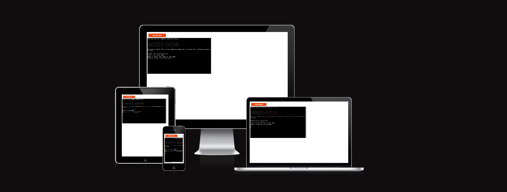
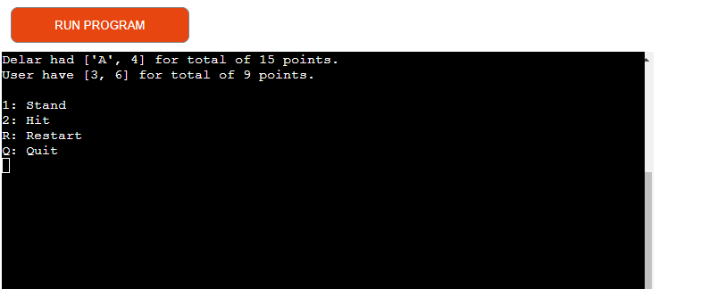
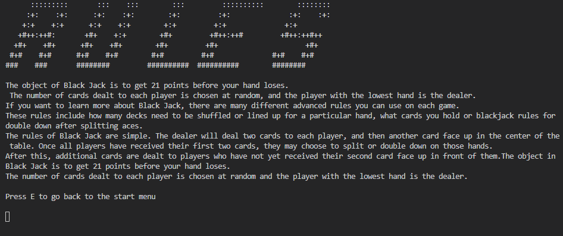
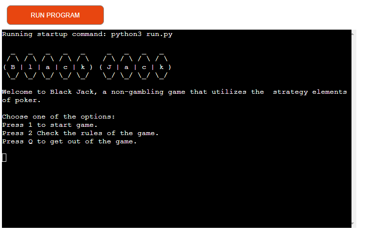
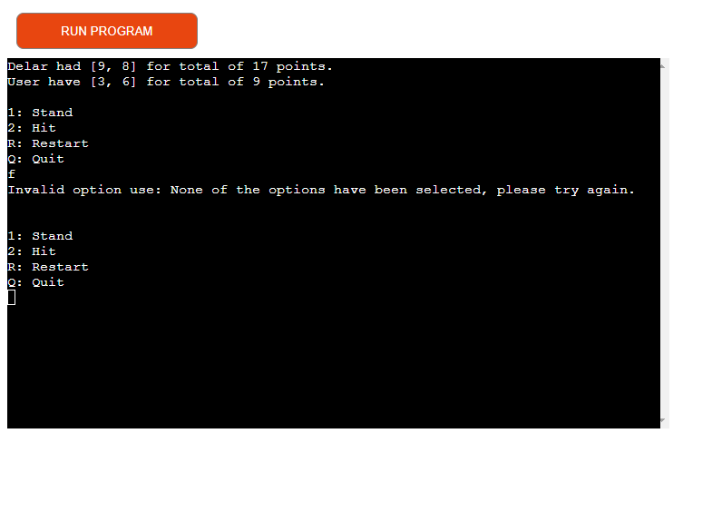
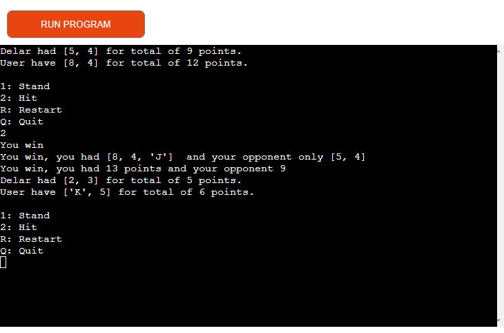
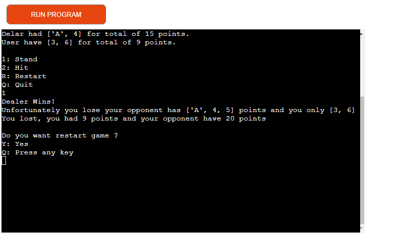
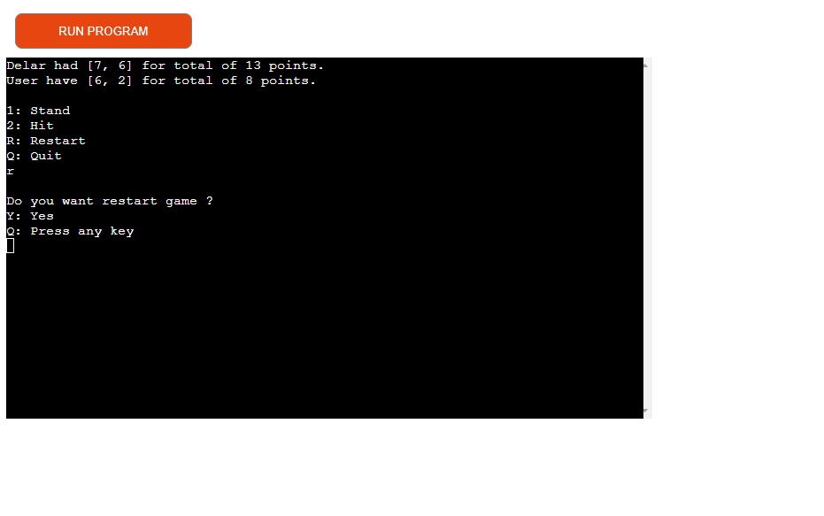
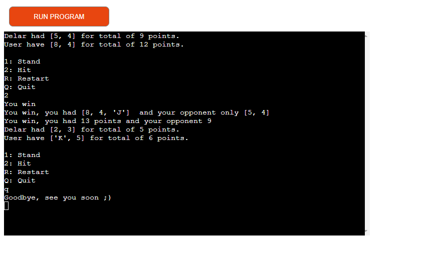
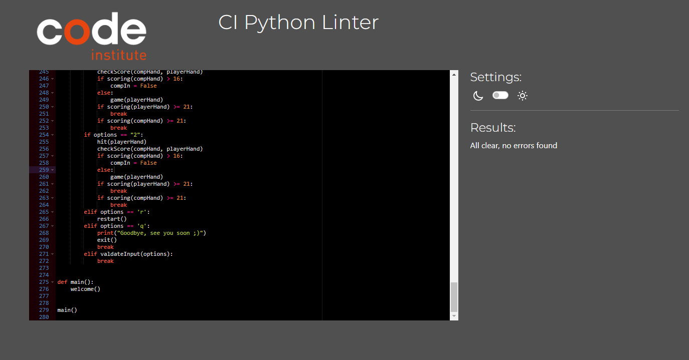

# Black Jack 
Black Jack is a terminal game , with run in the Code Institute mock terminal on Heroku. Blackjack is traditionally a gambling game, now there's an alternative way to play!
Blackjack is an exciting card game that can draw you in with its action and fun. Developed by players for many years, the game of blackjack is made up of a dealer, a player, and a deck of cards. The objective is to get as close to 21 (on any point sooner than twenty-one) without going over. This can be achieved by hitting cards, standing on soft 17s, standing on hard 17s, or splitting pairs. Blackjack is a game that requires skill and knowledge about how other players are interpreting their hands to make an optimal play. This script will let you simulate blackjack games at home on your computer.
## How to play 
The Blackjack game is a great way to practice your learning how to play  BlackJack in your terminal . First, start out by going through the instructions on how to play. Then try playing it yourself, in which  on your hand and take another card in hopes of making the best decision for yourself. Once you get into this, there are many other choices you can make that determine if you stay or go with the cards you have dealt.The first person to reach 21 or comes closest to that score wins.
If you want you can read more about the game at [Wikipedia](https://en.wikipedia.org/wiki/Blackjack) 
## Features 
###  Current features
- Display of menu 

- Displays the game rules for the player before playing 
 
- Random cards dealing
	* Cards remain randomly selected for the user and the computer
	* The user can see both his and his opponent's cards and scores
	 
- Playing against the computer
-Making decisions to stand or hit 
	
- Accepting player input or rejecting it if wrong selected input 
 
- Check user win 
 
- Check win of the computer 
 
- Give the user the option to restart the game at every step
 
- Make it possible to exit the game
 
 
 

### Future Features 
 

* Entering player scoreboard
* Opportunities to enter a username at the start of the game
* Scoring of the games and displaying it on the screen
## Testing 
* I manually tested the program does the following 
    - Tested in my local GitPod terminal and Code Institut terminal 
    - Passed the code through a PEP8 linter and confirmed there are no error 
    - Attempt to enter invalid date 
### Bugs 
+ No possibility of leaving the rules due to the attempt to handle small and large liters. Fixed with removing the uppercase operator.
### Remaining bugs 
+ The appearance of the font in rules
+ Line breaks in the rules in appropriate places for better visibility in the terminal
### Validator Testing 
- PEP8
	* No erros found on [https://pep8ci.herokuapp.com/#](https://pep8ci.herokuapp.com/#)
	
## Deployment 
This project was deployed using a Code Institute's mock terminal for Heroku. 
- Fork or clone this repository  
- Create a new app on Heroku  
- Set buildpacks to Python and NodeJS 
- Link the app to the repository  
- Deploy 
## Local deployment
* Fork
	- On GitHub.com, navigate to the [azimny86/blackJack](https://github.com/azimny86/blackJack) repository.
	- In the upper right corner of the page, click the fork.
	- Select an owner for the forked repository.
	- By default, forks have the same names as their parent repositories, if you want you can change the name of the fork to make it more distinct.
	- Select whether you want to copy only the default branch or all branches if any to the new fork.
	- Click Create fork.
* Cloning
	- On GitHub.com, navigate to the [azimny86/blackJack](https://github.com/azimny86/blackJack) repository.
	- In the center of the screen, select the code icon.
	- Copy the URL for the repository.
		* To clone the repository using HTTPS, under "HTTPS", click .
		* To clone the repository using an SSH key, including a certificate issued by your organization's SSH certificate authority, click SSH.
		* To clone a repository using GitHub CLI, click GitHub CLI.
	- Open Git Bash.
	- Change the current working directory to the location where you want to work on clone directory.
	- Type **git clone** and past URL of repository.

## Credits
 * My meteor Mitko Bachvarov helped me a lot in creating this project.
 * [Wikipedia](https://en.wikipedia.org/wiki/Blackjack)  for Blackjack rules